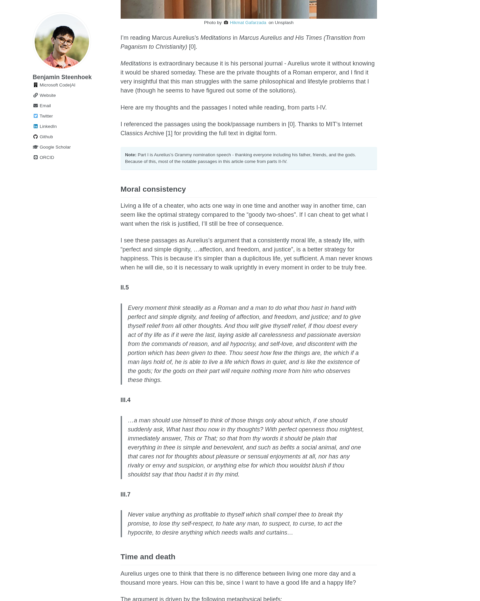
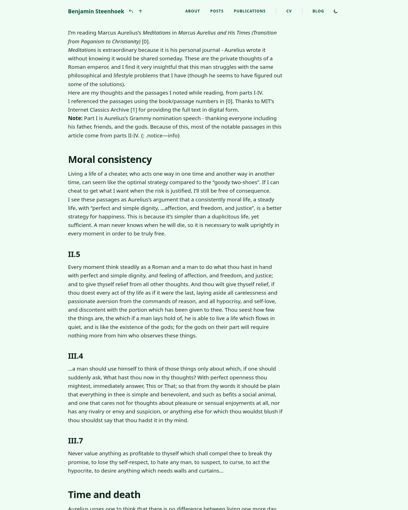
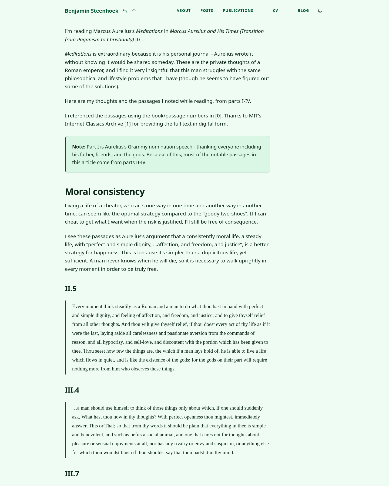

# Meditations formatting comparison

Chromium screenshots of the same article, captured at 1440 × 1800 with a light
color scheme. The comparison views begin at the opening paragraph and show paragraph spacing,
the first note, and quotations.

| Before migration                          | After migration                         | Final               |
| ----------------------------------------- | --------------------------------------- | ------------------- |
|  |  |  |

- **Before migration:** rebuilt the original Jekyll source at
  `7c5eb98ed5df13ac668aca18c0e10290e97b8088`, the parent of the Astro migration
  commit `4dbb750`. Captured `/posts/2022/06/meditations-1-thru-4/` using the
  original templates, Kramdown content, images, and Sass. The isolated rebuild
  used Jekyll 4.3.4 with the source configuration's URL set to localhost.
- **After migration:** unmodified Astro source at
  `f383d6831b546c1c9c24271cbc74f1c526f4277d`, captured at
  `/writing/meditations-1-thru-4/` before applying this fix.
- **Final:** the repaired Astro build in this branch, captured at the same
  canonical URL and viewport.

Additional final views at 390 × 1200:
[mobile light](final-mobile-light.png) and [mobile dark](final-mobile-dark.png).

The prose styles restore paragraph spacing, quote borders and inset serif type,
and list markers throughout `.body` content. The article's two Jekyll attribute
annotations are replaced by semantic asides with theme-aware callout styling.
Its wording is preserved; the longer aside is split into two paragraphs.

Validation: Prettier, ESLint, Astro Check, Markdownlint, a static build, and all
15 Playwright tests passed. Four regression cases cover 390px and 1440px widths
in both themes, checking notes, Markdown emphasis, all eight quotes, paragraph
spacing, list markers, and horizontal containment.

In an agent environment, run the checks with Astro's foreground preview mode:

```sh
ASTRO_TELEMETRY_DISABLED=1 ASTRO_PREVIEW_BACKGROUND=1 npm run check
```
